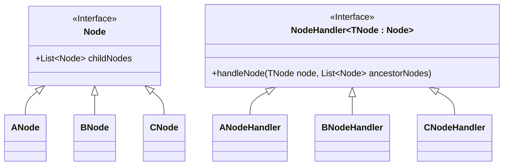
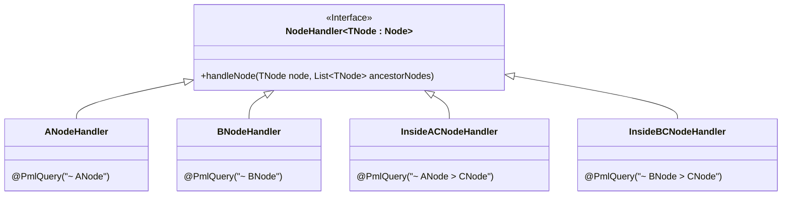
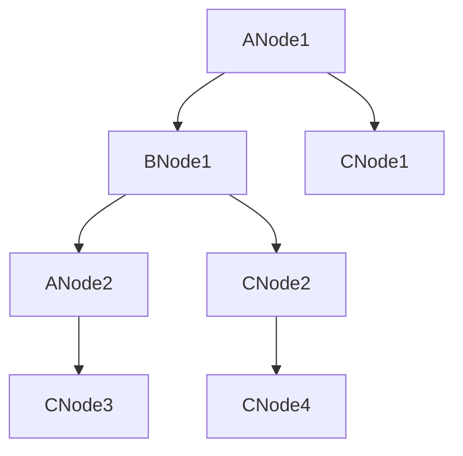

<!--suppress HtmlDeprecatedAttribute -->

<p align="center">
    
</p>

<p align="center">
    
    
    
    
</p>

---

# Overview

Welcome to **PML**, Path Matching Language &mdash; a generic tree/node object traversal and path matching framework.

PML allows you to bind tree-traversal handlers using a visitor-esque pattern to the corresponding node placement in a graph, rather than just their types. This is comparable to the manner with which CSS (Cascading Style Sheet) selectors matched on a Document Object Model (DOM) tree.

## Capabilities

For example, assume an inheritance hierarchy of `Node` type implementations; `ANode`, `BNode`, and `CNode`. These types correspond to their associated `NodeHandler<>` implementations; `ANodeHandler`, `BNodeHandler`, and `CNodeHandler`.



This pattern should be familiar, and is seen widely in software projects. However, without additional logic polluting the `handleNode` implementations, a visitor would generally dispatch node handling based on type rather than graph position.

When using PML, one can add path matching metadata (annotations) to the handlers which allow finer-grain evaluation.

For example, we will use the following annotations and some additional `NodeHandler<>` implementations.



- `ANodeHandler` will match any `ANode` with the query `~ ANode`.
- `BNodeHandler` will match any `BNode` with the query `~ BNode`.
- `InsideACNodeHandler` will ONLY match a `CNode` if it's a direct child of an `ANode`, with the query `~ ANode > CNode`.
- `InsideBCNodeHandler` will ONLY match a `CNode` if it's a direct child of an `BNode`, with the query `~ BNode > CNode`.

> Note the use of the `~` and `>` operators, for global and direct-child matching respectively.

In practice, one of these annotated handlers would look something like the following.

```kotlin
@PmlQuery("~ ANode > CNode")
class InsideACNodeHandler : NodeHandler<CNode>
{
    override fun handleNode(node: CNode, ancestorNodes: List<Node>)
    {
        prindentln(ancestorNodes.size, "InsideACNodeHandler (~ A > C) : ${node::class.simpleName}")
    }
}
```

With this in mind, the following object graph can be traversed and use the corresponding handling.  



- `ANode1` is handled by `ANodeHandler`.
- `BNode1` is handled by `BNodeHandler`.
- `CNode1` is handled by `InsideACNodeHandler`, as the `CNode` is a direct child of `ANode`.
- `ANode2` is handled by `ANodeHandler`.
- `CNode2` is handled by `InsideBCNodeHandler`, as the `CNode` is a direct child of `BNode`.
- `CNode3` is handled by `InsideACNodeHandler`, as the `CNode` is a direct child of `ANode`.
- `CNode4` is not handled, as there are no handlers to match arbitrary `CNode` objects.

# Selectors

PML selectors use the following grammar.

```text
( ( '>' | '~' ) ( <name> | '*' ) ( '{' <expression> '}' )? )+
```

- A traversal operator &mdash; either `~` for deep matching, or `>` for direct child (flat) matching.
- An element identifier &mdash; either a name for node name matching, or `*` for any (wildcard) matching.
- An optional boolean logic expression to perform fine grain matching.

## Expressions

TODO

## Selector Specificity

PML selector specificity is, again, similar to the implementation familiar to those in CSS. When competing selectors target the same node, the selector with the highest specificity will be used.

The selector specificity is implemented as a 3-value type, in order to allow for simple precedence comparison.

- The first value is derived from traversal operators.
- The second value is derived from element matching types.
- The third value is derived from whether expressions are present, and the expression(s) complexity.

For example the following selectors both target `BNode` with differing specificity.

```
~ ANode 
```

This selector has a specificity of `(a=1, b=10, c=0)`

- A deep matching operator increases `a` by `1`.
- A named element matching selector increases `b` by `10`.
- There are no expressions so `c` remains `0`.

```
~ BNode > CNode
```

This selector has a specificity of `(a=11, b=20, c=1)`

- A deep matching operator increases `a` by `1`, and a child matching operator increases `a` by `10`, to a total of `11`
- Two named element matching selectors increase `b` by `10` each, to a total of `20`.
- There are no expressions so `c` remains `0`.

# Integrations

TODO

## Spring

TODO

# License

The MIT License; please see the [license file](./LICENSE) for more information.
